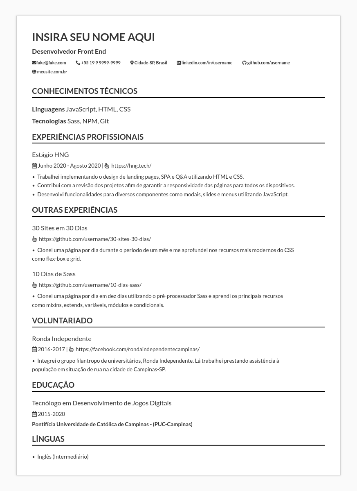

# Template de currílo para profissionais de TI.



- Clone o repositório localmente
- Rode `npm install` para instalar as dependências <br> **Observação:**
  - Caso o NPM não esteja instalado, vá até a página do [Node.js](https://nodejs.org/en/download/), baixe a respectiva versão LTS do seu sistema e instale.
  - Após instalados, rode os comandos abaixo e veja se a versão do node e da npm são exibidas no console. Caso sim, a instalação foi efetivada com sucesso.
    ```bash
      node -v
    ```
    ```bash
      npm -v
    ```
- Rode o comando `npm run start` para compilar o sass e abrir o projeto no navegador.
